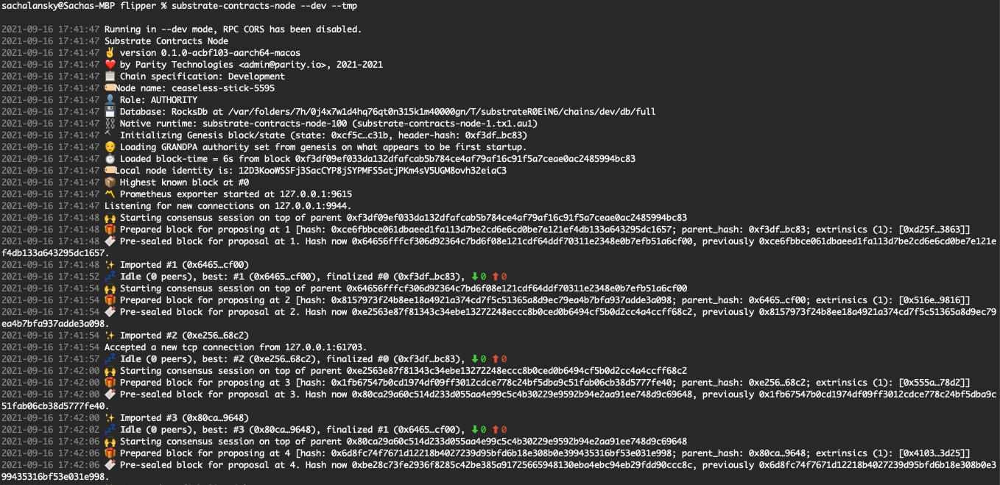

Running a Substrate Smart Contracts Node
===

After successfully installing [`substrate-contracts-node`](https://github.com/paritytech/substrate-contracts-node),
you can start a local development chain by running:

```bash
substrate-contracts-node --dev --tmp
```



You should start seeing blocks being produced by your node in your terminal.

You can interact with your node using the hosted version of Canvas UI at:

<a href="https://paritytech.github.io/canvas-ui">https://paritytech.github.io/canvas-ui</a>

Now configure the UI to connect to the locally running node:

- Click on the dropdown selector at bottom left corner.
- Choose the Local Node.


